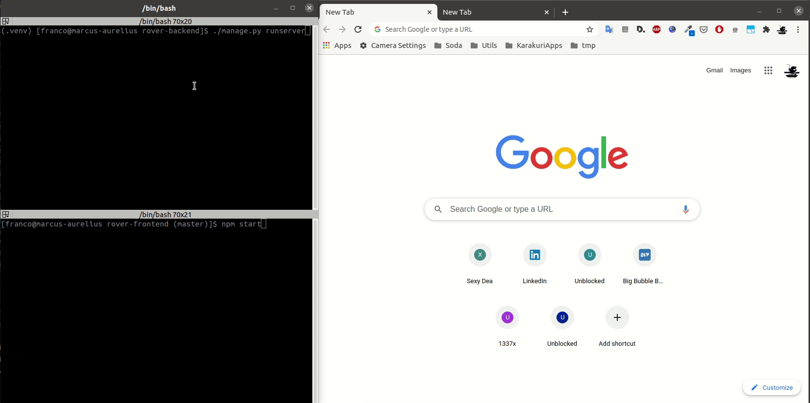
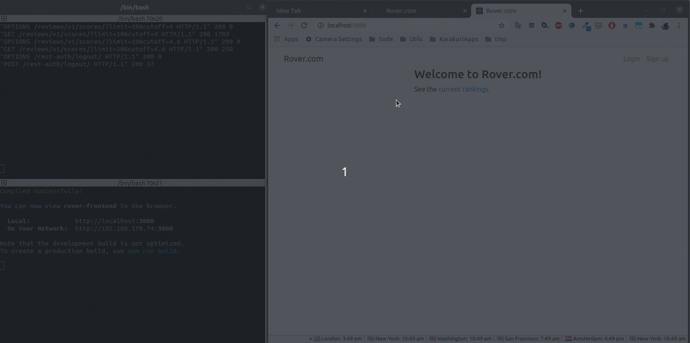

# Rover.com Front-end

## Overview

The requirements are described in more detail in the [requirements](../specification/README.md).

For more details regarding the backend-end refer to [rover-backend](../rover-backend)

Giving the specification and the time constraints, the front-end currently supports the following use cases:

- Account Recovery:

1.  User tries to login and fail (due to the data crash).
2.  User resets password.
3.  User finally logs-in.
4.  User list rankings.



- Account Registration:

1.  User registers for a new account.
2.  User logs-in.
3.  User list rankings.



Note that for the purposes of this demonstration, the back-end hasn't been configured with a real email server (we are using Django's console email back-end).

## TODO's

- More unit tests.
- End-to-end tests using a framework such as [Cypress](https://www.cypress.io/) or [Selenium Webdriver](https://webdriver.io/).
- Add a page for submitting reviews.
- Add a page for showing the user profile in detail.
- Give the user the capability of editing their profile information, including uploading a picture.

Probably in this order. More automated tests (particularly end-to-end) before adding more features makes more sense in my opinion.

## Installing Dependencies

You will need NodeJS to run this project. You will also need an instance of [rover-backend](../rover-backend) running.

To install all the package dependencies:

```
npm install
```

This project uses `react` 17, `react-tables` 7, as well as `bootstrap` 4.

## Running the App

```
npm start
```

## Running Tests

```
npm test
```

## Building the App

To create a production build:

```
npm run build
```
